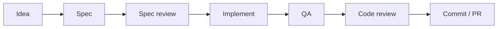

# AppVerk Claude Code Marketplace

[](LICENSE)
[](#available-plugins)

Claude Code plugins that compose into one development harness — from idea and spec, through TDD implementation and QA, to code review and commit — with each stage's artifact feeding the next.

## Installation

```bash
/plugin marketplace add AppVerk/av-marketplace
```

After installation, verify with `/help` — you should see the new commands listed.

### Oh My Pi (OMP)

An OMP edition is generated from the same sources: Code Review and the Frontend, PHP and Python developer plugins. It adds one OMP-only plugin, **Delivery**:

```bash
omp plugin marketplace add AppVerk/av-marketplace
for p in code-review delivery python-developer frontend-developer php-developer; do
  omp plugin install "$p@av-marketplace"
done
```

Delivery needs Python 3.9 or newer, available as `python3` on `PATH`: its plan check, task router and preflight run Python. Without it, approving a plan does not start a delivery and the plan runs as usual.

Delivery runs approved plans end to end, without slash commands. Plan in OMP plan mode (`/plan`). In a git repository the plan's Approach is written as `### Task N:` blocks, each listing its files; proposing a plan whose task mixes stacks, lists no files or has a malformed `### Task` heading is rejected with the reason. Before creating a branch or committing the plan, delivery stops if the working tree has changes other than the plan itself, or if the plan check finds a problem. Approving a plan that has tasks starts the delivery:

1. the plan is committed to `docs/plans/<date>-<slug>.md` — on a new `delivery/<slug>` branch when you are on `main` or `master`;
2. each task goes to the developer agent that owns its files (Python, React, PHP, or a generic implementer), is reviewed, gets up to 3 fix rounds, and is committed;
3. the plan's Verification runs, then `/code-review:review` over the delivered commits. If you save the review report, delivery commits that report alone, then offers `/code-review:fix-all`, whose changes stay uncommitted.

A plan without `### Task` headings runs as usual. `/delivery:execute <plan>` resumes an interrupted delivery, skipping committed tasks, or delivers a plan file you wrote yourself; tasks of such a plan that list no files are routed by Jev (the `judge` model role, e.g. `typesafe/jev-latest`) when it is at least 0.8 confident; below that, or on every such task when the `judge` role resolves to a non-Jev model, delivery asks you. See the [Delivery guide](docs/plugins/delivery.md) for the plan format and prerequisites.

Agents route through model roles instead of a fixed model: reviewers use `code_review`, fixers and developers `executor`, adversarial verification `challenger`, finding analysis (composite grouping, needs-decision findings, PR feedback) `analyst`, and plan mode `plan`. Map each role in `~/.omp/agent/config.yml`, for example:

```yaml
modelRoles:
  code_review: anthropic/claude-opus-5-5
  analyst: anthropic/claude-opus-5-5
  executor: openai-codex/gpt-5.5
  challenger: openai-codex/gpt-5.5
```

An unmapped role falls back to the model the Claude Code edition names (`opus`), or to the session model where that edition inherits one.
The generator accepts only these documented project roles in overlays; to introduce another user-configured role, document it here and add it to `MODEL_ROLES` in `scripts/build_omp_edition.py`.

## Workflow

The plugins are designed to work together as a full development cycle:



Each stage leaves an artifact the next stage consumes: the brainstormed spec is reviewed by `/superutils:spec-review`, the implementation is exercised by `/qa:loop`, and QA and review reports share one issue-ID scheme, so `/fix SEC-001` and `/fix QA-001` work the same way. See the [Recommended Workflow](docs/workflow.md) guide for the full cycle, stage by stage.

## Available Plugins

| Plugin | Version | Description |
|--------|---------|-------------|
| [Code Review](docs/plugins/code-review.md) | 2.1.0 | Security, architecture, and code quality analysis with OWASP compliance. Unique issue IDs (SEC-001, PERF-001, DOC-001, QA-001, ...), fix by ID via `/fix SEC-001` (or `/fix QA-001`), batch via `/fix-report` (auto-merges review and QA reports), or fix everything via `/fix-all`, which then offers to resolve `needs-decision` findings with you (optional severity floor). Persist PR review feedback via `/analyze-feedback`. Built-in cross-analysis and adversarial review via Cross-Verifier + Challenger. Groups findings that share one cause into composite findings (`COMP-001`) and fixes each as one unit, with a one-question veto |
| [Commit](docs/plugins/commit.md) | 1.4.0 | Conventional Commits message generation. Auto-blocks direct `git commit`; blocks force-push/`--mirror`/protected-branch deletion and prompts on pushes to `master`/`main`, tags, and non-origin remotes |
| [Security Pipeline](docs/plugins/security-pipeline.md) | 1.0.1 | CI/CD security scanning setup with `/setup` command. Auto-detects provider (Bitbucket, GitHub Actions, GitLab CI, Azure DevOps), languages, and frameworks. Generates Semgrep SAST + TruffleHog secret scanning steps with OWASP Top 10 enforcement |
| [Web Auditor](docs/plugins/web-auditor.md) | 2.1.5 | Comprehensive web audit: security, SEO, performance, and compliance. Optional `--verify` for cross-domain correlation and adversarial review |
| [Frontend Developer](docs/plugins/frontend-developer.md) | 1.2.1 | TypeScript + React development workflow with `/develop` command and autonomous `developer` agent. Coding standards, TDD, and stack-specific patterns (Tailwind, Zustand, TanStack Query, React Hook Form, TanStack Router) |
| [PHP Developer](docs/plugins/php-developer.md) | 1.0.3 | PHP development workflow with `/develop` command and autonomous `developer` agent. Coding standards, TDD, and stack-specific patterns (Symfony, Doctrine ORM, DDD) |
| [Python Developer](docs/plugins/python-developer.md) | 3.0.4 | Python development workflow with `/develop` command and autonomous `developer` agent. Coding standards, TDD, and stack-specific patterns (FastAPI, SQLAlchemy, Pydantic, Django, DRF, Celery) |
| [QA](docs/plugins/qa.md) | 2.6.0 | Automated QA testing — analyzes code changes, generates test plans (`/qa:create-plan`), executes FE (Playwright) and BE (API/DB) tests (`/qa:run`), and self-drives the test→fix→retest loop (`/qa:loop` now generates a plan for the branch when none exists, then runs). Produces reports compatible with code-review's `/fix QA-001` and `/fix-report` auto-merge |
| [Superutils](docs/plugins/superutils.md) | 2.0.0 | Companion utilities for the superpowers workflow. `/superutils:spec-review` runs a bounded triage pipeline on design specs: MoA lens panel, challengers for criticals, an approve-gated fix batch, verification of the applied edits, a second approve-gated batch — hard dispatch and time budgets, every residual reported, every verdict advisory (never "Verified") |
| [Simple Language](docs/plugins/simple-language.md) | 1.0.0 | Scannable, plain-language replies and documents: answer first, one idea per sentence, no undefined jargon. Activates automatically at session start via a `SessionStart` hook |
| [Sequential Thinking](https://github.com/modelcontextprotocol/servers/tree/main/src/sequentialthinking) | MCP | Structured problem-solving through dynamic thinking process |

## Documentation

- [Recommended Workflow](docs/workflow.md)
- [Installation & Optional Tools](docs/installation.md)
- [Plugin Guides](docs/plugins/)
- [Contributing](docs/contributing.md)

## Support

- **Bug Reports**: [GitHub Issues](https://github.com/AppVerk/av-marketplace/issues)
- **Feature Requests**: Submit with the `enhancement` label

## License

This project is licensed under the [MIT License](LICENSE).
