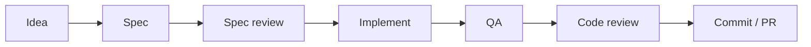

# AppVerk Claude Code Marketplace

[](LICENSE)
[](#available-plugins)

Claude Code plugins that compose into one development harness — from idea and spec, through TDD implementation and QA, to code review and commit — with each stage's artifact feeding the next.

## Installation

Add the marketplace, then install the plugins you need. [Available Plugins](#available-plugins) lists their IDs and which tool supports each one.

### Claude Code

```bash
/plugin marketplace add AppVerk/av-marketplace
/plugin install <plugin>@av-marketplace
```

You can also pick plugins in the Discover tab of `/plugin`. Verify with `/help`: the installed plugins' commands are listed.

### Oh My Pi (OMP)

```bash
omp plugin marketplace add AppVerk/av-marketplace
omp plugin install <plugin>@av-marketplace
```

`omp plugin install` accepts several plugin IDs at once. The [Oh My Pi guide](docs/oh-my-pi.md) covers updating, prerequisites and the models we recommend per role.

## Workflow

The plugins are designed to work together as a full development cycle:


```mermaid
flowchart LR
    A[Idea] --> B[Spec]
    B --> C[Spec review]
    C --> D[Implement]
    D --> E[QA]
    E --> F[Code review]
    F --> G[Commit / PR]
```

Each stage leaves an artifact the next stage consumes: the brainstormed spec is reviewed by `/superutils:spec-review`, the implementation is exercised by `/qa:run` (config → plan → test → fix → retest), and QA and review reports share one issue-ID scheme, so `/fix SEC-001` and `/fix QA-001` work the same way. See the [Recommended Workflow](docs/workflow.md) guide for the full cycle, stage by stage.

## Available Plugins

| Plugin | Version | ID | Claude Code | OMP | Description |
|--------|---------|----|:-----------:|:---:|-------------|
| [Code Review](docs/plugins/code-review.md) | 2.1.1 | `code-review` | ✓ | ✓ | Security, architecture, and code quality analysis with OWASP compliance. Unique issue IDs (SEC-001, PERF-001, DOC-001, QA-001, ...), fix by ID via `/fix SEC-001` (or `/fix QA-001`), batch via `/fix-report` (auto-merges review and QA reports), or fix everything via `/fix-all`, which then offers to resolve `needs-decision` findings with you (optional severity floor). Persist PR review feedback via `/analyze-feedback`. Built-in cross-analysis and adversarial review via Cross-Verifier + Challenger. Groups findings that share one cause into composite findings (`COMP-001`) and fixes each as one unit, with a one-question veto |
| [Commit](docs/plugins/commit.md) | 1.4.0 | `commit` | ✓ | ✓ | Conventional Commits message generation. Auto-blocks direct `git commit`; blocks force-push/`--mirror`/protected-branch deletion and prompts on pushes to `master`/`main`, tags, and non-origin remotes |
| [Security Pipeline](docs/plugins/security-pipeline.md) | 1.0.1 | `security-pipeline` | ✓ | — | CI/CD security scanning setup with `/setup` command. Auto-detects provider (Bitbucket, GitHub Actions, GitLab CI, Azure DevOps), languages, and frameworks. Generates Semgrep SAST + TruffleHog secret scanning steps with OWASP Top 10 enforcement |
| [Web Auditor](docs/plugins/web-auditor.md) | 2.1.5 | `web-auditor` | ✓ | — | Comprehensive web audit: security, SEO, performance, and compliance. Optional `--verify` for cross-domain correlation and adversarial review |
| [Frontend Developer](docs/plugins/frontend-developer.md) | 1.2.2 | `frontend-developer` | ✓ | ✓ | TypeScript + React development workflow with `/develop` command and autonomous `developer` agent. Coding standards, TDD, and stack-specific patterns (Tailwind, Zustand, TanStack Query, React Hook Form, TanStack Router) |
| [PHP Developer](docs/plugins/php-developer.md) | 1.0.4 | `php-developer` | ✓ | ✓ | PHP development workflow with `/develop` command and autonomous `developer` agent. Coding standards, TDD, and stack-specific patterns (Symfony, Doctrine ORM, DDD) |
| [Python Developer](docs/plugins/python-developer.md) | 3.0.5 | `python-developer` | ✓ | ✓ | Python development workflow with `/develop` command and autonomous `developer` agent. Coding standards, TDD, and stack-specific patterns (FastAPI, SQLAlchemy, Pydantic, Django, DRF, Celery) |
| [QA](docs/plugins/qa.md) | 3.0.0 | `qa` | ✓ | ✓ | `/qa:run` bootstraps `.av/config.toml`, provisions test accounts, reuses or generates a reviewed plan, and runs FE (browser) and BE (API/DB) tests through a bounded test→fix→retest loop. `/qa:create-plan` lets you review the plan first. Fixes require batch approval by default; reports work with code-review's `/fix QA-001` and `/fix-report` |
| [Delivery](docs/plugins/delivery.md) | 0.5.0 | `delivery` | ✓ | ✓ | Delivers implementation plans task by task, without asking which developer to use: each task goes to the developer agent that owns its files (or, without a file list, its code), is reviewed and committed, then the plan's Verification and a full code review run. Starts when you approve a plan-mode plan, and in Claude Code also when you pick subagent-driven execution for a Superpowers plan. `/delivery:execute` resumes an interrupted delivery |
| [Plan Review](docs/plugins/plan-review.md) | 0.1.0 | `plan-review` | — | ✓ | A second model (the `advisor` role) reviews every plan-mode plan before the approval dialog; the plan cannot be proposed until a review approves it or 3 review rounds are used |
| [Superutils](docs/plugins/superutils.md) | 2.0.0 | `superutils` | ✓ | — | Companion utilities for the superpowers workflow. `/superutils:spec-review` runs a bounded triage pipeline on design specs: MoA lens panel, challengers for criticals, an approve-gated fix batch, verification of the applied edits, a second approve-gated batch — hard dispatch and time budgets, every residual reported, every verdict advisory (never "Verified") |
| [Simple Language](docs/plugins/simple-language.md) | 1.0.0 | `simple-language` | ✓ | — | Scannable, plain-language replies and documents: answer first, one idea per sentence, no undefined jargon. Activates automatically at session start via a `SessionStart` hook |
| [Sequential Thinking](https://github.com/modelcontextprotocol/servers/tree/main/src/sequentialthinking) | MCP | `sequentialthinking` | ✓ | — | Structured problem-solving through dynamic thinking process |

## Documentation

- [Recommended Workflow](docs/workflow.md)
- [Installation & Optional Tools](docs/installation.md)
- [Oh My Pi (OMP)](docs/oh-my-pi.md)
- [Plugin Guides](docs/plugins/)
- [Contributing](docs/contributing.md)

## Support

- **Bug Reports**: [GitHub Issues](https://github.com/AppVerk/av-marketplace/issues)
- **Feature Requests**: Submit with the `enhancement` label

## License

This project is licensed under the [MIT License](LICENSE).
