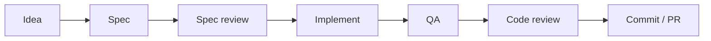

# Recommended Workflow

How the AppVerk marketplace plugins compose into one development harness —
the lifecycle of a feature from idea to merged PR. Each stage produces an
artifact the next stage consumes; nothing is handed over by memory. Most
hand-offs are automatic — where one needs your input, the stage says so.

## Prerequisites

- This marketplace installed: `/plugin marketplace add AppVerk/av-marketplace`
- **Strongly recommended:** the `superpowers` plugin from the official
  Claude Code plugin marketplace — install with
  `/plugin install superpowers@claude-plugins-official`. It drives Stage 1
  (brainstorming the spec that Stage 2 reviews) and provides the plan-first
  implementation flow in Stage 3. Without it the cycle degrades gracefully:
  start at Stage 3; Stages 1–2 are skipped.

See [Installation & Optional Tools](installation.md) for the optional
scanners and linters the plugins auto-detect.

## The cycle



### Stage 1 — Idea → Spec *(superpowers, strongly recommended)*

**Purpose:** turn an idea into an agreed design before any code exists.

Ask Claude to brainstorm the feature; the superpowers brainstorming skill
asks clarifying questions, proposes approaches, and writes the agreed
design to a spec file.

**Artifact:** `docs/superpowers/specs/YYYY-MM-DD-<topic>-design.md`
**Next stage consumes:** the spec file — spec-review reads it directly.

### Stage 2 — Spec review *(superutils)*

**Purpose:** catch contradictions, ambiguity, and gaps while they are
still cheap to fix.

```
/superutils:spec-review
```

Runs a fixed triage pipeline on the newest spec (lens panel → challengers
for criticals → an approve-gated fix batch → verification of the applied
edits → a second approve-gated batch). One pass; nothing repeats.

Two things the stage asks of you. When the resolved spec is a committed file
it names it and asks before editing it in place — a bare `--auto` run stops
there unless `--allow-dirty`, so name the spec to run headless. And every run
leaves a pre-loop snapshot beside the report; snapshots and reports are
working artifacts, not deliverables — prune them with the branch's other
working artifacts before merge.

**Artifact:** report and pre-loop snapshot in
`docs/superpowers/specs/reviews/`; terminal status `TRIAGED`
(`TRIAGED (incomplete)` when something the pipeline owed did not land or
return) or `STOPPED(...)` — a stop is never success.
**Next stage consumes:** the reviewed spec, now the contract for the plan —
passed by you: unlike the other hand-offs, Stage 3 does not discover it on
its own; reference the spec in the task or plan you hand to it.

### Stage 3 — Plan & implement

**Purpose:** build the feature test-first against the reviewed spec.

**Recommended:** point Claude at the right specialist in the project's
`CLAUDE.md` (or in the spec itself) — e.g. "Implementation work in this
repo uses the python-developer plugin: dispatch its `developer` agent and
its skills." A standing note like this makes whichever flow drives the
implementation — the superpowers plan flow or a direct request — pick the
matching developer agent (frontend-developer, php-developer,
python-developer) instead of a general-purpose one.

With the delivery plugin installed, picking subagent-driven execution for
a superpowers plan hands the plan to Delivery instead: each task goes to
the developer agent that owns its files, with no `CLAUDE.md` note needed,
and is reviewed and committed on a new `delivery/<slug>` branch when you
start on `main` or `master`, or on the current branch otherwise; then the
plan's Verification, QA when the change is testable, and a full code
review run. See the [Delivery guide](plugins/delivery.md).

```
/develop <task>
```

The stack-specific `/develop` command is the explicit alternative — it
enforces the same coding standards and TDD for its stack. If you use it,
include the reviewed spec path in `<task>` — e.g.
`/develop Implement docs/superpowers/specs/2026-07-23-foo-design.md` —
`/develop` reads only the task text you give it. For stacks without a
developer plugin, use the superpowers writing-plans / TDD skills.

**Artifact:** implemented, tested code on the feature branch.
**Next stage consumes:** the branch diff — QA generates its test plan
from it.

### Stage 4 — QA *(qa)*

**Purpose:** verify the change end-to-end (frontend and backend) before
review.

```
/qa:run
```

`/qa:run` proposes the project config on first use, reuses or generates a
reviewed plan for the branch, then tests with configured existing users and
accounts registered by testers, fixes eligible failures and re-tests within
the engine's fixed limits. A configured cleanup recipe deletes registered
accounts at teardown; without one, QA warns that they remain in the app.
Commit `.av/config.toml` so later runs reuse the team's setup. Source fixes
need batch approval by default; `qa.fix = "off"` tests and reports
without fixing. Use `/qa:create-plan` → `/qa:run <plan-path>` when you want
to inspect or edit the plan first. See the [QA guide](plugins/qa.md) for
mutation policy, trust and headless behavior.

With the delivery plugin, Delivery runs this stage itself after the plan's
Verification when the delivered change is testable, with the same
questions, and commits QA's fixes, configuration, plan and report before
its final review (see [Delivery: QA](plugins/delivery.md#qa)). Run
`/qa:run` yourself outside Delivery, or to test again later.

**Artifact:** test plans in `docs/testing/plans/`, reports with `QA-XXX`
issue IDs in `docs/testing/reports/`.
**Next stage consumes:** the QA report — code-review's fix commands
operate on its issue IDs.

### Stage 5 — Code review *(code-review)*

**Purpose:** security, performance, architecture, and maintainability
analysis with addressable findings.

```
/review
```

The report assigns each issue a unique ID (`SEC-XXX`, `PERF-XXX`, `ARCH-XXX`,
`MAINT-XXX`, `DOC-XXX`, `COMP-XXX`). Fix a single issue with `/fix <ID>`, work
through reports as a checklist with `/fix-report` (auto-merges review and QA
reports), or fix everything except `needs-decision` issues with `/fix-all`.

**Artifact:** review report in `docs/reviews/` — answer Yes at the save
prompt; `/fix <ID>` and `/fix-report` resolve issues from the saved file.
**Next stage consumes:** the working tree with every accepted fix applied —
still uncommitted; `/commit` picks the changes up.

### Stage 6 — Commit & PR *(commit)*

**Purpose:** ship the change with a clean history and guarded pushes.

```
/commit
```

Generates a Conventional Commits message; push guards protect
`master`/`main`, tags, and non-origin remotes. After opening the PR,
handle reviewer feedback with the code-review plugin's
`/analyze-feedback`.

**Artifact:** commits — pushing and opening the PR remain manual steps,
with pushes guarded by the plugin; feedback analysis persisted by
`/analyze-feedback`.

## Cheat sheet

| Stage | Plugin | Command | Artifact |
|---|---|---|---|
| 1. Idea → Spec | superpowers *(external)* | brainstorm with Claude | `docs/superpowers/specs/*.md` |
| 2. Spec review | superutils | `/superutils:spec-review` | `docs/superpowers/specs/reviews/*` |
| 3. Plan & implement | delivery or frontend/php/python-developer (or superpowers) | superpowers plan → subagent-driven execution (Delivery), or `CLAUDE.md` note → `developer` agent (or `/develop <task>`) | code on the branch |
| 4. QA | qa | `/qa:run` (or `/qa:create-plan` first); Delivery runs it for testable deliveries | `.av/config.toml`, `docs/testing/plans/*`, `docs/testing/reports/*` |
| 5. Code review | code-review | `/review`, then `/fix` · `/fix-report` · `/fix-all` | `docs/reviews/*` |
| 6. Commit & PR | commit | `/commit` | commits (PR opened manually) |

## Outside the cycle

- **web-auditor** — `/audit <url>`: passive web audit (security, SEO,
  performance, compliance) of a running site; independent of the feature
  cycle.
- **security-pipeline** — `/setup`: one-time generation of CI/CD security
  scanning steps (Semgrep + TruffleHog) for your pipeline.
- **sequentialthinking** — MCP server used by other plugins (e.g.
  superutils decomposition); no commands of its own.

Flags, options, and edge cases for every command live in the per-plugin
guides: [Plugin Guides](plugins/).
